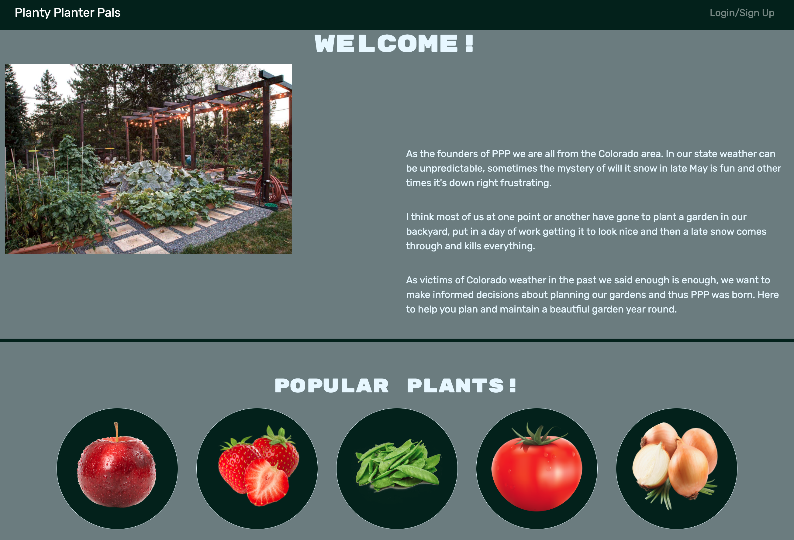
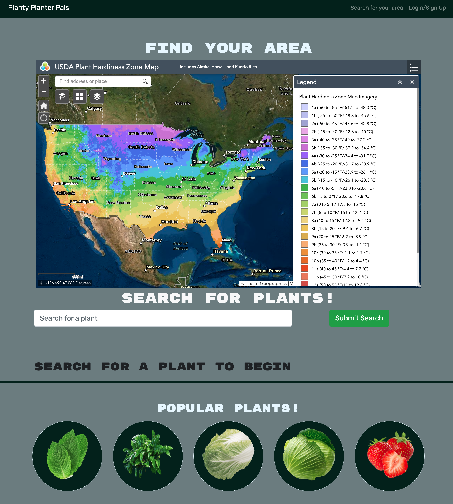

# Planting Planters

## GitHub Repository & Deployed Application
* https://github.com/dfaidley23/Planting-Planters
* https://planty-planters.herokuapp.com/

## 
* [Description](#description)
* [Technolgies Used](#technolgies-used)
* [Installation Instructions](#installation-instructions)
* [Usage Info](#usage-info)
* [Contribution Guide](#contribution-guide)
* [Instructions for testing](#instructions-for-testing)
* [Questions](#questions)
* [Screenshots](#screenshots) 

## 
Planting-Planters is a garden planner.

As a gardner I'd like to go to one website. Where I will be able to plan my garden around my hardiness zone. Which will let me make an informed decision on which plants to select for my garden.

With my plants all in one place, I can ensure I’ve planted plants in my garden that will survive and thrive in my hardiness zone. 

## 
* Javascript
* HTML
* CSS
* Bootstrap
* React
* Node JS
* Mongo
* Moongoose
* Mongo Atlas
* GraphQL
* Apollo
* Bcrypt
* Express
* JSON webtoken
* JWT decode

## 
1) Run `npm i` to install node packages 
2) Run `npm run seed` to create and seed databases 
3) Run `npm run develop1` if your on version 16 of node
4) or Run `npm run develop2` if your on version 17.9.0 of node and on a windows machine
5) or Run `npm run develop3` if your on version 17.9.0 of node an on a mac

## 
1) Run `npm run seed` 
6) Run `npm run develop1` or `develop2` or `develop3`

## 
* Framework code was taken from previous class activity. 
* Received advice and instruction from University of Denver bootcamp Instructors/TAs. 
* Main contributors: Josh Tibbitts, Delilah Haas and David Faidley

## 
* Routes can be tested with Insomonia 
* DB can be tested by running queries directly in Apollo

## 
Home screen

Hardniess zone map & Search functionality

## 
If you have questions, you can either open a issue in my Github repository  
GitHub: <https://github.com/dfaidley23>  
 
Or you can send me an email directly  
Email: 
Delilah <ila0406@gmail.com>,
David <david.faidley23@gmail.com>,
Josh <joshtibbetts12@gmail.com>